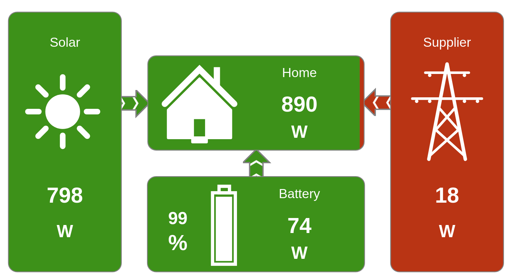

[](https://gitlab.com/bboehmke/sunny/pipelines)
[](https://gitlab.com/bboehmke/sunny)

# Sunny

Sunny is a library to get actual data from SMA inverters and energy meters 
via Ethernet (Speedwire).

> Note: SMA & Speedwire are registered trademarks by
> [SMA Solar Technology AG](https://www.sma.de/en/company/about-sma.html)

## Usage

> The password in the following function is the one of the user account which 
> is by default "0000".

To discover reachable devices call:

```go
devices, err := sunny.DiscoverDevices(password)
```

This will return a list of device instances that can be used for additional 
communication.

To directly connect to a device use:
```go
device, err := sunny.NewDevice(address, password)
```
Where address is the IP address of the device.

To get all current values from a device use `GetValues()`:
```go
values, err := device.GetValues()
```
`values` will be a `map[string]interface{}` with the values of the device.

The values differs from device to device:
*  Energy Meter: Every value that is provided. 
   See [Energy Meter Protocol](https://www.sma.de/fileadmin/content/global/Partner/Documents/SMA_Labs/EMETER-Protokoll-TI-en-10.pdf)
*  Inverters: Provided values that are decrypted.
   See `valuesDef` in [values.go](values.go)

> Note: The data from energy meters are broadcasted only once a second. 


## Monitor Application

There is also a simple monitor application provided as example how to use the 
library. This application requires exactly one energy meter, one PV inverter 
and one battery inverter.

If the application ist started it will discover this devices and starts a 
little web server that is reachable under http://127.0.0.1:8080 which
displays the actual state of the devices.



The following configurations can be changed via environment variables:

| Variable         | Description                                | 
| ---------------- | ------------------------------------------ |
| PASSWORD         | User password for inverter (Default: 0000) | 
| SOLAR_INVERTER   | Address of PV inverter                     | 
| BATTERY_INVERTER | Address of battery inverter                | 
| ENERGY_METER     | Address of energy meter                    | 

## Speedwire Protocol

The base protocol is implemented based on the information provided SMA
in the documentation of the 
[Energy Meter Protocol](https://www.sma.de/fileadmin/content/global/Partner/Documents/SMA_Labs/EMETER-Protokoll-TI-en-10.pdf) 
and the
[Speedwire device discovery](https://www.sma.de/fileadmin/content/global/Partner/Documents/sma_developer/SpeedwireDD-TI-en-10.pdf).

For the core functionality of the protocol are no public information available.
Because the missing information the main protocol structure is based on 
own packet analyses and some existing projects:

*  https://github.com/erijo/energy-utils
*  https://github.com/SBFspot/SBFspot
*  https://github.com/Rincewind76/SMAInverter
*  https://gitlab.com/volkerkettenbach/FHEM-SMA-Speedwire
*  https://github.com/pvlog/pvlib
